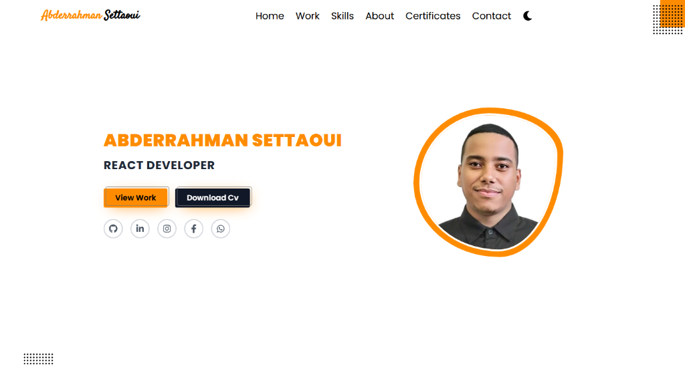

# Abderrahman Settaoui - Personal Portfolio



<div align="center">
  <a href="https://abderrhmansettaoui.netlify.app/" target="_blank">
    
  </a>
  <a href="https://github.com/abdarrhmanessetaoui/portfolio-2" target="_blank">
    
  </a>
</div>

<br />

A modern, responsive, and visually attractive personal portfolio built to showcase my projects, skills, and certifications. Designed with a focus on clean aesthetics, smooth animations, and optimal user experience.

---

## 📑 Table of Contents

- [Features](#-features)
- [Tech Stack](#-tech-stack)
- [Project Structure](#-project-structure)
- [Installation](#-installation)
- [Environment Variables](#-environment-variables)
- [Usage](#-usage)
- [Screenshots](#-screenshots)
- [Live Demo](#-live-demo)
- [Author](#-author)
- [License](#-license)

---

## ✨ Features

- **Modern UI/UX:** Clean and professional design with dark mode support.
- **Smooth Animations:** Page transitions and element reveals powered by Framer Motion.
- **Dynamic Projects Showcase:** Easily manageable projects list with detailed views for each project.
- **Skills Section:** Categorized skills (Frontend, Backend, Tools) with Devicon logos.
- **Certifications:** Dedicated section to display professional certificates.
- **Contact Form:** Fully functional contact form integrated with Nodemailer.
- **Fully Responsive:** Optimized for mobile, tablet, and desktop devices.

---

## 🛠 Tech Stack

### Frontend
- **[Next.js](https://nextjs.org/)**: React framework for server-side rendering and static site generation.
- **[React](https://reactjs.org/)**: UI library for building component-based interfaces.
- **[Tailwind CSS](https://tailwindcss.com/)**: Utility-first CSS framework for rapid and responsive styling.
- **[Framer Motion](https://www.framer.com/motion/)**: Animation library for React to create smooth transitions.
- **[Typewriter Effect](https://github.com/tameemafi/typewriter-effect)**: For dynamic text typing animations on the hero section.

### Backend & API
- **Next.js API Routes**: Serverless functions handling form submissions.
- **[Nodemailer](https://nodemailer.com/)**: Module for sending emails securely from the contact form.

### Developer Tools & Deployment
- **[ESLint](https://eslint.org/) & [Prettier](https://prettier.io/)**: Code linting and formatting.
- **[Netlify](https://www.netlify.com/)**: Hosting and deployment platform.

---

## 📂 Project Structure

```text
portfolio_v2-main/
├── components/       # Reusable UI components (Navbar, Heading, MetaTags, etc.)
├── data/             # Static data files (projects.ts)
├── helpers/          # Utility functions and animation variants
├── pages/            # Next.js pages and API routes
│   ├── api/          # API routes (contact.ts)
│   ├── details/      # Dynamic project detail pages
│   ├── _app.tsx      # Custom App component
│   ├── index.tsx     # Homepage
│   ├── about.tsx     # About page
│   ├── work.tsx      # Projects page
│   ├── skills.tsx    # Skills page
│   └── certificates.tsx # Certifications page
├── public/           # Static assets (images, icons, CV)
├── styles/           # Global CSS and Tailwind configurations
├── tailwind.config.js# Tailwind CSS configuration
└── package.json      # Project dependencies and scripts
```

---

## 🚀 Installation

Follow these steps to run the project locally:

1. **Clone the repository:**
   ```bash
   git clone https://github.com/abdarrhmanessetaoui/portfolio-2.git
   cd portfolio-2
   ```

2. **Install dependencies:**
   ```bash
   npm install
   # or
   yarn install
   ```

3. **Set up environment variables:**
   Create a `.env.local` file in the root directory and add the required variables (see below).

4. **Start the development server:**
   ```bash
   npm run dev
   # or
   yarn dev
   ```

5. **Open the app:**
   Visit `http://localhost:3000` in your browser.

---

## 🔐 Environment Variables

To make the contact form work, you need to configure your SMTP credentials. Create a `.env.local` file in the root of your project and add the following:

```env
# SMTP Configuration for Nodemailer (e.g., Gmail App Password)
user=YOUR_EMAIL_ADDRESS
pass=YOUR_EMAIL_APP_PASSWORD
```

> **Note:** Never commit your actual `.env.local` file. It is already included in `.gitignore`.

---

## 💻 Usage

- **Adding a Project:** Edit `data/projects.ts` to add new projects. The portfolio will automatically update the Work page and generate dynamic detail pages.
- **Updating Skills:** Modify the `skillGroups` array in `pages/skills.tsx`.
- **Updating Certificates:** Add new entries to the `certificates` array in `pages/certificates.tsx`.

---

## 📸 Screenshots

<details>
<summary>Click to view screenshots</summary>

### Homepage


</details>

---

## 🌐 Live Demo

Check out the live version of the portfolio here:  
**[https://abderrhmansettaoui.netlify.app/](https://abderrhmansettaoui.netlify.app/)**

---

## 👨‍💻 Author

**Abderrahman Settaoui**
- GitHub: [@abdarrhmanessetaoui](https://github.com/abdarrhmanessetaoui)
- LinkedIn: [Abderrahman Settaoui](https://www.linkedin.com/in/abderrahman-settaoui/)

---

## 📄 License

This project is open-source and available under the [MIT License](LICENSE).
